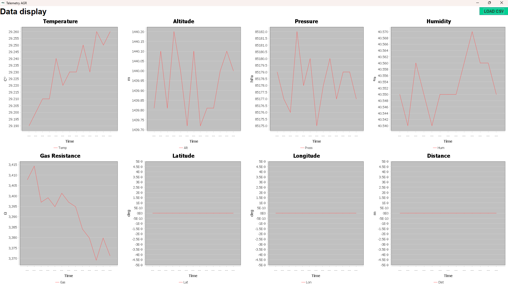

# TelemetryCenter – Rover AGR

TelemetryCenter is a desktop application designed to receive, process, and visualize real-time telemetry data from the Rover AGR system. The software acts as the monitoring interface for the rover’s logical control computer, allowing operators to observe telemetry data and a live video feed.


## Overview

The application receives telemetry packets transmitted from the rover over the network and displays them in a graphical interface. It also includes a video receiver using OpenCV and supports person detection using Haar Cascade classifiers.

This software is part of the Rover AGR project and is intended for monitoring, testing, and development of the rover system.

## Features

* Real-time telemetry reception via UDP
* Visualization of telemetry data
* Graphical monitoring interface
* Live video feed from the rover
* Target detection using OpenCV Haar Cascades
* Modular architecture for telemetry processing



## Requirements

* Java 17 or newer
* OpenCV native library
* Haar Cascade XML files
* Network connection to the rover system

## Required Files

For the application to work correctly, the following files must be located **in the same folder**:

```
TelemetryCenter_jar.jar
opencv_java4120.dll
haarcascade_fullbody.xml
haarcascade_frontalface_alt.xml
```

If these files are not in the same directory, the application may fail to start or the person detection module may not work.

## Running the Application

Open a terminal in the folder where the files are located and run:

```
java -jar TelemetryCenter_jar.jar
```

## OpenCV Setup

The OpenCV native library (`opencv_java4120.dll`) must be accessible to Java. Placing the DLL in the same folder as the JAR is the simplest way to ensure it is found by the application.

## Project Purpose

TelemetryCenter was developed as part of the Rover AGR project to provide a reliable system for monitoring telemetry data and video streams from the rover during operation and testing.

## Authors

Rover AGR Development Team
